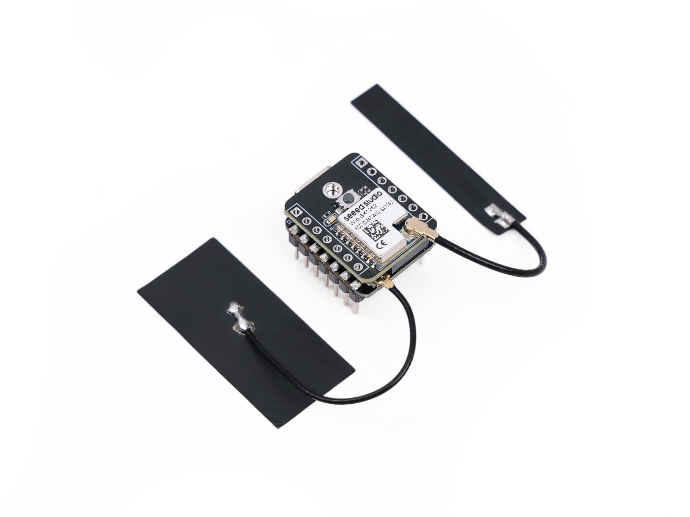
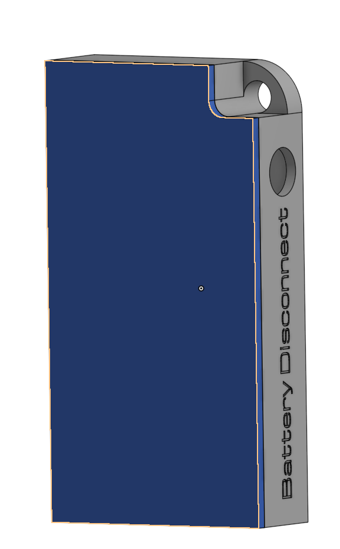
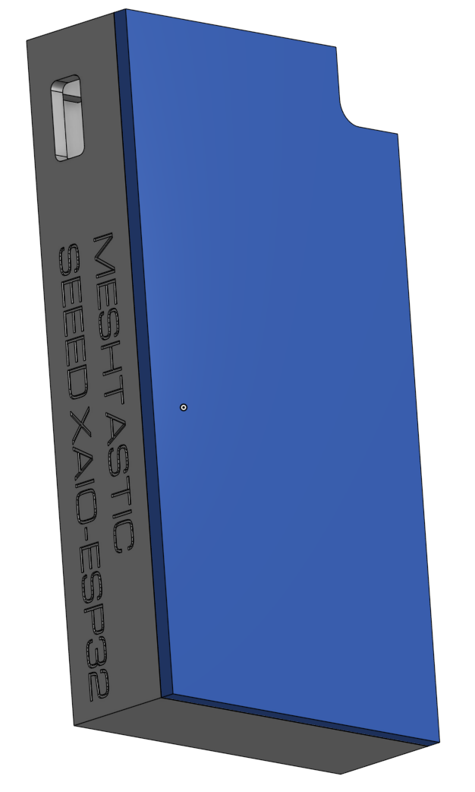

# Intro

This repo connects to any [meshtastic node and logs PAX data](https://meshtastic.org/docs/configuration/module/paxcounter/) it sees. 
It also plots that data as needed. 

# Install Instructions
1) You need to install Python 3
    - https://www.geeksforgeeks.org/python/download-and-install-python-3-latest-version/
2) Run `pip3 install -r requirements.txt` in the command line to install required modules

# Running the logger
1) Make sure you have a meshtastic node connected via serial or on the local wifi network
2) Run the `log_pax.py` script
	- This can be done from the command line or by double clicking it depending on your computer

When working, as long as there is a nearby PAX counter node the terminal should start to look like this

```
No Serial Meshtastic device detected, attempting TCP connection on localhost.
Error: Could not connect to node via serial
Trying to connect to device at: meshtastic.local via internet
Connected to: i74
PAX:
    Time:2025-09-13T13:55
    BLE:2
   WIFI:0
  TOTAL:2
PAX:
    Time:2025-09-13T14:00
    BLE:4
   WIFI:0
  TOTAL:4
PAX:
    Time:2025-09-13T14:05
    BLE:4
   WIFI:0
  TOTAL:4
```

# Running the plotter
1) Run the `plot_pax.py` script
	- This can be done from the command line or by double clicking it depending on your computer
2) The plot will be saved to the Plots folder and shown, feel free to close it out when done

# Specific Hardware XAIO-ESP32


## Charging the deployable nodes
1) Make sure the Node is on before plugging it in
	- The battery dicsonnect button will be "out" and there should be blinking lights showing the node is running by the USB-C port.
2) Connect the USB-C Cable
	- If you do not re-connect the battery the node will be ON but not charging the battery
3) Charge for a few hours, at most overnight




## Cases
See the STL folder for the cases I designed, or [go here to see them on OnShape](https://cad.onshape.com/documents/7882ec43ecfdc11d0b2a0a64/w/4b09f0a90ad4ef7e086749e0/e/0f791da7b69e675c5f7ba2cd?renderMode=0&uiState=68c5c1ee73540302ab060f17)